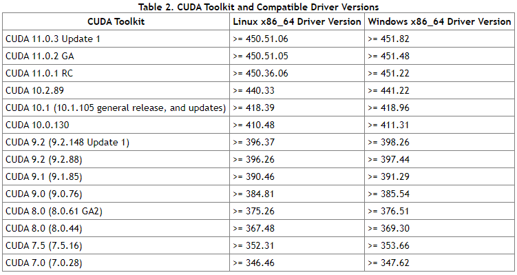

## Installation


### Requirements

- WINDOWS10 with Python == 3.6
- PyTorch == 1.5.1 and [torchvision](https://github.com/pytorch/vision/) that matches the PyTorch installation.
  You can install them together at [pytorch.org](https://pytorch.org) to make sure of this
- OpenCV is optional and needed by demo and visualization
- 详情如下


### Build Detectron2 from Source

**0. 安装NVIDIA显卡驱动, 安装CUDA(因为底层需要用到c++编译deformable conv层)**  
  
  **注意:**:由于后面用conda安装pytorch会安装conda的cudatoolk包, 需要确保cudatoolk和本地的CUDA版本一致
  
  
**1. 根据NVIDIA显卡驱动确定自己可以安装的CUDA版本以及pytorch版本**  
  
    
  
  上图来自[cuda-toolkit-release-notes](https://docs.nvidia.com/cuda/cuda-toolkit-release-notes/index.html#cuda-whats-new)  
  比如我的驱动版本是432.00, 最高只能安装CUDA 10.1, 不能安装CUDA10.2.89及以上版本
  
  
**2. 打开命令窗口安装pytorch(目前只测试过pytorch=1.5.1)(假设将这些安装到detectron2_custom环境下)**  
```
conda create -n detectron2_custom python=3.6
conda activate detectron2_custom
conda install pytorch=1.5 torchvision cudatoolkit=10.1 -c pytorch
```
(用conda安装时, 有些版本pytorch只能在特定版本的cudatoolkit下安装)
  
  
**3. (**本仓库已修改, 可跳过**)修改xxx\detectron2\detectron2\layers\csrc\cocoeval\cocoeval.cpp line 483**  
```
//localtime_r(&rawtime, &local_time); //报错, 未识别的标识符
localtime_s(&local_time, &rawtime);
```
  
  
**4. 下载[VS生成工具](https://visualstudio.microsoft.com/zh-hans/visual-cpp-build-tools/), 安装Visual Stutio生成工具2019**  
  
  
**5. 在当前命令窗口激活VS生成工具(假设VS生成工具安装在默认路径)**  
```
call "C:\Program Files (x86)\Microsoft Visual Studio\2019\BuildTools\VC\Auxiliary\Build\vcvars64.bat"
```
  
  
**6. 切换到detectron2目录, 开始编译**  
```
cd xxx\detectron2
python setup.py build develop
```
最后会提示pycocotools安装失败, 这是因为官方的pycocotools不支持win10, 先不用管
  
  
**7. 安装其他需要的包**  
```
pip install opencv-python tqdm matplotlib fvcore cython cloudpickle mock tensorboard
```
如果出现`ERROR: Could not install packages due to an EnvironmentError: [WinError 5] 拒绝访问。`错误, 用管理员权限打开一个命令窗口来安装
  
  
**8. 测试安装成功**  
```
python
import detectron2
```
  
  
**9. 测试demo, 到[detectron2 MODEL ZOO](https://github.com/facebookresearch/detectron2/blob/master/MODEL_ZOO.md) 下载 [Faster R-CNN X101-FPN](https://dl.fbaipublicfiles.com/detectron2/COCO-Detection/faster_rcnn_X_101_32x8d_FPN_3x/139173657/model_final_68b088.pkl)模型权重, 假设放在目录xxx下**  

```
python demo/demo.py ^
--config-file configs/COCO-Detection/faster_rcnn_X_101_32x8d_FPN_3x.yaml ^
--input demo/coco_val2017_000000002153.jpg ^
--opts MODEL.WEIGHTS xxx/faster_rcnn_X_101_32x8d_FPN_3x.pkl
```
  
  
**10. (可选)安装pycocotools**

改写版本的pycocotools看起来是不会再更新了，因此能安装原版pycocotools的话最好
安装教程[参考](https://www.cnblogs.com/wildgoose/p/12905200.html)
本仓库已经加入了这个包，并且修改过，可以跳过第0、1步。
0. git clone https://github.com/philferriere/cocoapi
1. 修改cocoeval.py
2. 安装pip install cython
3. cd cocoapi\PythonAPI
4. python setup.py install
  
  
**Note that**:
1. .
2. .

### Common Installation Issues

Click each issue for its solutions:

以下为测试使用

<details>
<summary>
Undefined C++ symbols (e.g. `GLIBCXX`) or C++ symbols not found.
</summary>
<br/>
Usually it's because the library is compiled with a newer C++ compiler but run with an old C++ runtime.

This often happens with old anaconda.
Try `conda update libgcc`. Then rebuild detectron2.

The fundamental solution is to run the code with proper C++ runtime.
One way is to use `LD_PRELOAD=/path/to/libstdc++.so`.

</details>
